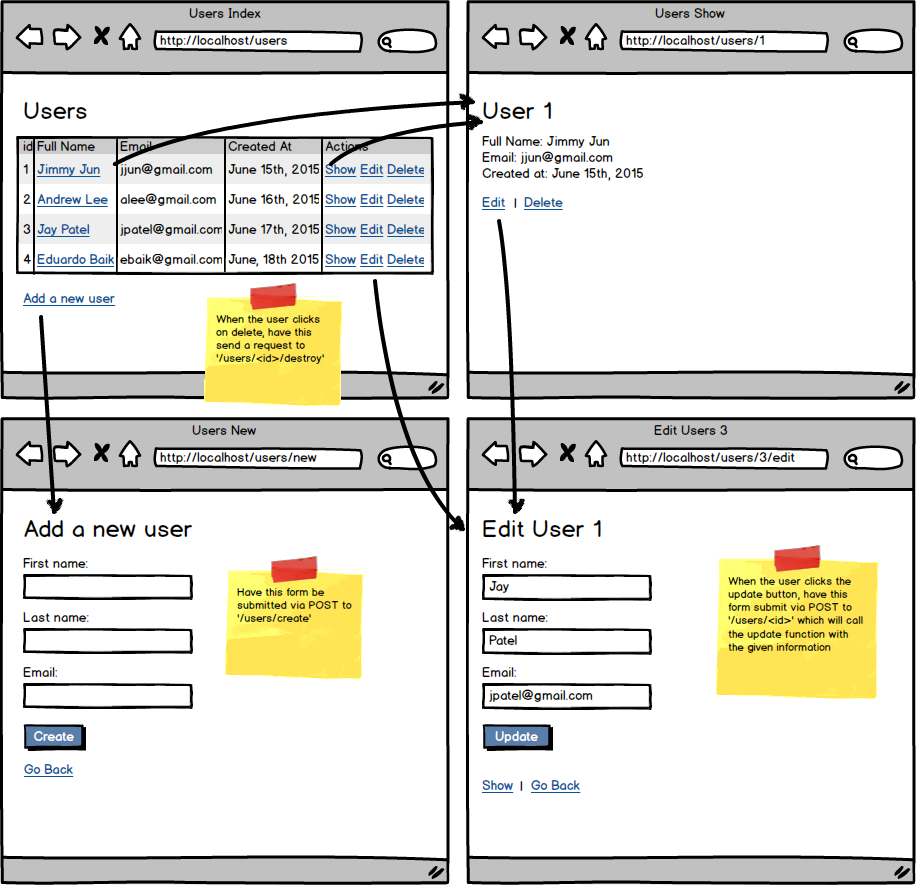

# Assignment: Semi-Restful Users

Create an app that can handle all of the CRUD operations (create, read, update and destroy) for a table.  Ensure that you add validation rules before saving the records in the database.

Follow the instructions in the wireframe below to build this application in Django.

Have 7 routes. Because we are working with 'users', they might look like:

* a GET request to /users - calls the index method to display all the users. This will need a template.
* GET request to /users/new - calls the new method to display a form allowing users to create a new user. This will need a template.
* GET request /users/<id>/edit - calls the edit method to display a form allowing users to edit an existing user with the given id. This will need a template.
* GET /users/<id> - calls the show method to display the info for a particular user with given id. This will need a template.
* POST to /users/create - calls the create method to insert a new user record into our database. This POST should be sent from the form on the page /users/new. Have this redirect to /users/<id> once created.
* GET /users/<id>/destroy - calls the destroy method to remove a particular user with the given id. Have this redirect back to /users once deleted.
* POST /users/update - calls the update method to process the submitted form sent from /users/<id>/edit. Have this redirect to /users/<id> once updated.
